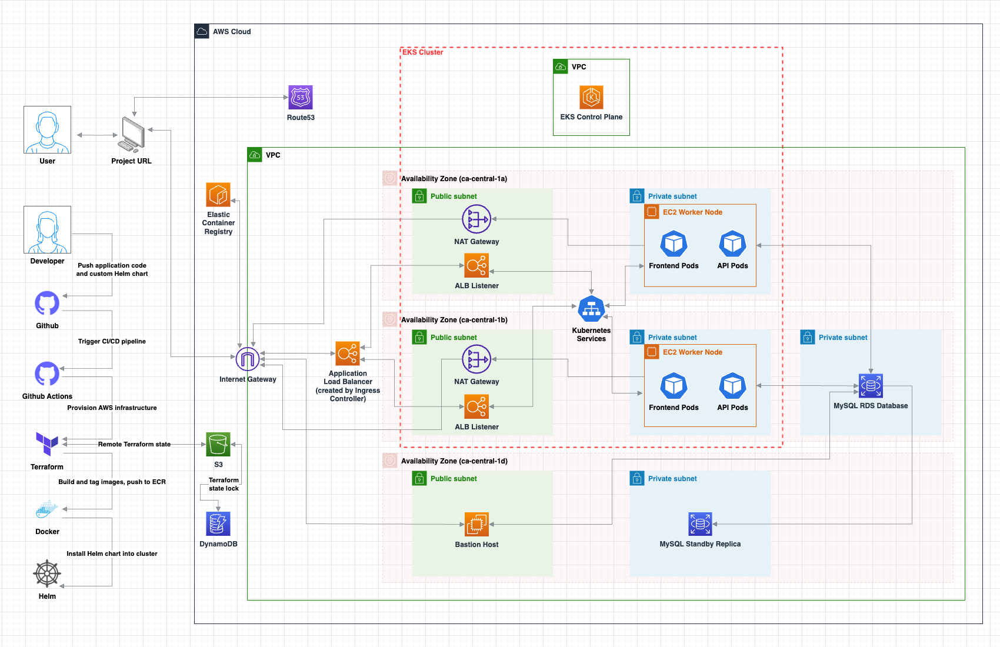

# Kubernetes Message Board

#### Summary

- This project implements a full-stack web application (an online message board) and deploys it to a custom, highly available Kubernetes cluster on AWS using Elastic Kubernetes Service (***___without___*** the use of premade tools such as eksctl).  
  
- The project consists of 4 parts: 
  - Web Application
  - Cloud Infrastructure
  - Helm Chart
  - CI/CD Pipeline

- Technologies used: Kubernetes, Helm, AWS, Terraform, Docker, Github Actions, JavaScript (ReactJS), Python (Flask), MySQL  

- AWS services used: EKS, ECR, VPC, Subnets, DynamoDB, ALB, RDS, EC2, S3, Route53, IGW, NATGW, SG, Route Tables

#### Architecture Diagram

#### Notes

- The web application can be broken down into 3 tiers
  - The frontend tier runs in the "frontend pods" in the EKS cluster. This tier consists of a React application that presents the message board UI to the user.
  - The api tier runs in the "api pods" in the EKS cluster. This tier is a Flask application that directs traffic between the frontend and database tiers.
  - the database tier, which runs outside of the EKS cluster. The tier is a multi-AZ MySQL RDS database that contains user messages.
    
- The Helm Chart consists of:
  - Deployments for both the frontend and API tiers. Each deployment creates 2 pods per worker node, meaning that each worker node runs 2 frontend pods and 2 API pods.
  - Services for both the frontend and API pods.
  - MySQL ConfigMap and Secrets, these are used as environment variables for the API pods in order for them to authenticate to the database properly to read / write messages.

- Ingress rules use the frontend service as the default backend.

- The CI/CD pipeline contains Secrets / Variables that are injected into the Helm Chart's MySQL ConfigMap / Secret, as part of the Job that installs the Helm Chart into the EKS cluster.

#### Directory Structure
<pre>
├── .github
│   └── workflows
│       └── cicd_pipeline.yml
├── api
│   ├── Dockerfile
│   ├── api.py
│   └── requirements.txt
├── cloud_infrastructure
│   ├── bastion_host.tf
│   ├── eks.tf
│   ├── ingress_controller.tf
│   ├── network.tf
│   ├── node_group.tf
│   ├── outputs.tf
│   ├── provider.tf
│   ├── rds.tf
│   └── variables.tf
├── frontend
│   ├── Dockerfile
│   ├── package-lock.json
│   ├── package.json
│   ├── public
│   └── src
└── kubernetes-message-board
    ├── Chart.yaml
    ├── templates
    │   ├── api-deployment.yaml
    │   ├── api-service.yaml
    │   ├── frontend-deployment.yaml
    │   ├── frontend-service.yaml
    │   ├── mysql-configmap.yaml
    │   └── mysql-secret.yaml
    └── values.yaml
</pre>

#### Future Enhancements / Todo

- Bastion host is a potential single point of failure, as it's only provisioned in one subnet in one availability zone and is needed to configure the MySQL database.
- Docker images are tagged as "latest", this makes it hard to roll back to previous images if needed.
- Helm Chart versions are not being incremented on subsequent code pushes.
